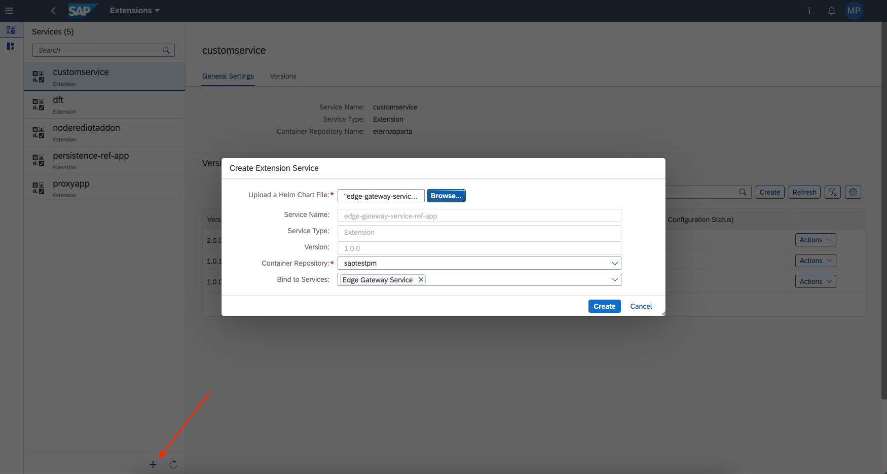
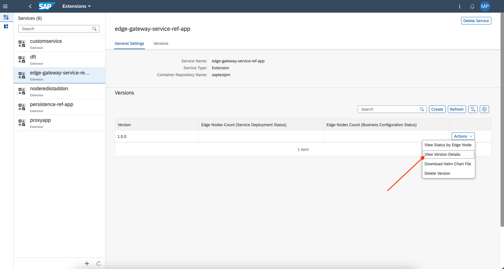
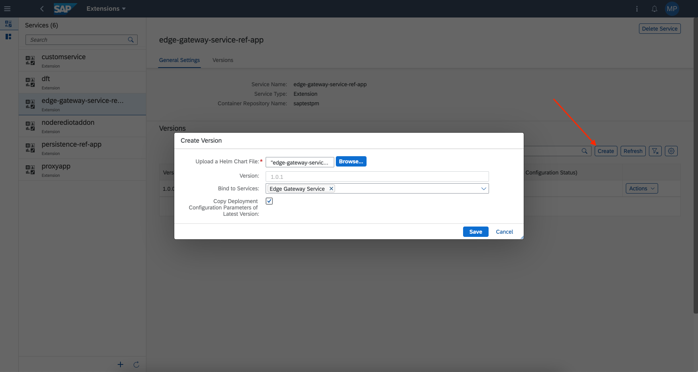

## Prerequisites

 -   You have licensed SAP Internet of Things (with the new capacity unit based licensing introduced in August 2020, your company has a Cloud Platform Enterprise Agreement or Pay-As-You-Go for SAP BTP and you have subscribed to the `oneproduct` service plan)
 -   You have setup the subscription for SAP IoT in your global account in a tenant (e.g. in the DEV tenant, the guide for the basic setup is at [Get Started with Your SAP IoT Account](https://help.sap.com/viewer/195126f4601945cba0886cbbcbf3d364/latest/en-US/bfe6a46a13d14222949072bf330ff2f4.html) ).
 - You have knowledge how to [manage users](https://help.sap.com/viewer/65de2977205c403bbc107264b8eccf4b/Cloud/en-US/a3bc7e863ac54c23ab856863b681c9f8.html) and [role collections](https://help.sap.com/viewer/65de2977205c403bbc107264b8eccf4b/Cloud/en-US/9e1bf57130ef466e8017eab298b40e5e.html) in the SAP Business Technology Platform
 - Your SAP User has at a minimum the `iot_role_collection` created during onboarding of your tenant and the associated roles (see [SAP Help on Providing Authorizations in](https://help.sap.com/viewer/195126f4601945cba0886cbbcbf3d364/latest/en-US/2810dd61e0a8446d839c936f341ec46d.html) ) and all the required roles for the SAP Internet of Things Edge feature, see [Configure Role Collections for Users](https://help.sap.com/viewer/247022ddd1744053af376344471c0821/2109b/en-US/7e0ddf3d1ef24a42b68cd75fc526302c.html#5f0427eab54d467bb18871ce0d41e862.html)
 -   You have knowledge on the containerisation, i.e. [Docker](https://docker.io)
 -   You have knowledge on the Helm (https://helm.sh) package manager, and the runtime installed

## Details
### You will learn
  - How to modify an existing Helm chart
  - How to assemble an Helm chart as archive
  - How to create an extension service
  - How to create and use deployment parameters for your extension service
  - How create semantic versioning for your extension service

The creation of an extension service is a two steps operation. The first step consist in the creation of a container image and store it into a 3rd party container registry, as described in the tutorial

The second step consists in the creation of a new Helm solution (chart), and store the created chart in the cloud of **SAP IoT Edge**.

---

[ACCORDION-BEGIN [Step 1: ](Create Helm Chart)]

1.  Open the folder of your copy of **SAP Edge Gateway Service Reference Application** downloaded from the official

    ```YAML[5,10,13]
    # Default values for helm.
    # This is a YAML-formatted file.
    # Declare variables to be passed into your templates.

    bindings: ""

    replicaCount: 1

    image:
      name: saptestpm/gw-ref-app
      pullPolicy: Always
      # Overrides the image tag whose default is the chart appVersion.
      tag: "1.0.0"

    nameOverride: ""
    fullnameOverride: ""

    # IOT Edge parameters: added automatically by Policy Service
    iot:
      edge:
        bindings: ""

    dockerRegistry: ""
    imagePullSecret: secret-customer-repository-credentials

    serviceAccount:
      # Specifies whether a service account should be created
      create: false
      # Annotations to add to the service account
      annotations: {}
      # The name of the service account to use.
      # If not set and create is true, a name is generated using the fullname template
      name: ""

    podAnnotations: {}

    podSecurityContext: {}
      # fsGroup: 2000

    securityContext: {}
      # capabilities:
      #   drop:
      #   - ALL
      # readOnlyRootFilesystem: true
      # runAsNonRoot: true
      # runAsUser: 1000

    service:
      type: LoadBalancer
      port: 9000

    ingress:
      enabled: false
      className: ""
      annotations: {}
        # kubernetes.io/ingress.class: nginx
        # kubernetes.io/tls-acme: "true"
      hosts:
        - host: localhost
          paths:
            - path: /
              pathType: ImplementationSpecific
      tls: []
      #  - secretName: chart-example-tls
      #    hosts:
      #      - chart-example.local

    resources:
      # We usually recommend not to specify default resources and to leave this as a conscious
      # choice for the user. This also increases chances charts run on environments with little
      # resources, such as Minikube. If you do want to specify resources, uncomment the following
      # lines, adjust them as necessary, and remove the curly braces after 'resources:'.
      limits:
        cpu: 500m
        memory: 128Mi
      requests:
        cpu: 500m
        memory: 128Mi

    autoscaling:
      enabled: false
      minReplicas: 1
      maxReplicas: 100
      targetCPUUtilizationPercentage: 80
      # targetMemoryUtilizationPercentage: 80

    nodeSelector: {}

    tolerations: []

    affinity: {}
    ```

3.  Open the file `templates/deployment.yaml` and search for the following lines:

    ```YAML
    env:
      - name: SERVICE_BINDINGS
        value: {{ .Values.iot.edge.bindings | quote }}
    ```

4.  Change the value of `value` to `{{ .Values.bindings | quote }}` and save the file.

    ```YAML
    env:
      - name: SERVICE_BINDINGS
        value: {{ .Values.bindings | quote }}
    ```

5.  Open the file `Chart.yaml`, you might would like to update `version` and `appVersion` to the same version provided to your container image, i.e. the version number `1.0.0` specified for `image.tag`, and save it.

6.  Check the project is correct with the `helm lint` command in a new terminal shell.

    ```Shell/Bash
    % helm lint
    ==> Linting .
    [INFO] Chart.yaml: icon is recommended

    1 chart(s) linted, 0 chart(s) failed
    ```

7.  Execute the command `helm package .` to assemble a `tgz` file for your Helm project.

    ```Shell/Bash
    % helm package .
    Successfully packaged chart and saved it to: /******/iot-edge-samples/IoT_Edge/edge-gateway-service-ref-app/helm/edge-gateway-service-ref-app-1.0.0.tgz
    ```

    Your solution has been compressed in one single file stored at the path provided in the output of your command, this is the file you will need it in the next step while uploading the file in the **SAP IoT Edge Extensions** UI.

[VALIDATE_1]
[ACCORDION-END]

[ACCORDION-BEGIN [Step 2: ](Create the Extension Service)]

1.  In the navigation area **IoT Edge**, click on the **Extensions** application in the SAP Internet of Things Fiori Launchpad

2.  Verify you are on the **Services** page or click on the proper icon to open the list of the available extension services

    !

3.  Press the **+** button in the bottom bar to register a new extension.

    !

4.  Fill the form with the following details:

    -  **Upload a Helm Chart File**: click on **Browse...**, navigate to your helm folder and use the `tgz` created for your Helm project, i.e.: `edge-gateway-service-ref-app-1.0.0.tgz`
    -  **Container Repository**: open the drop down menu and select the container repository registered in the step 1 of the tutorial
    -  **Bind to Services**:  open the drop down menu and select the **Edge Gateway Service**

    >You have to select in the **Bind to Services** area the **Edge Gateway Service** because the extension you are deploying with this tutorial is interfacing with the APIs exposed by the **Edge Gateway Service**. In case your custom implementation is using the **Persistence Service** APIs you must select **Persistence Service** in the drop down.

    >You can also bind your service to both if the service is invoking **Persistence Service** and **Edge Gateway Service** APIs. You can found further references in the [Consuming Dependent Services](https://help.sap.com/viewer/latest/70108a557bb24b5da8e0ac9cfb344067/2112a/en-US/c0c2743fee0d460390dc0037ede327e1.html) section in the Extension Service official documentation.

5.  Press **Create** to create the service.

6.  Select the just deployed extension in the list of **Services**.

7.  In the list of **Versions** opened in the right part of the screen, for the created version click on the **Actions** menu and select **View Version Details**.

    !

8.  In the **Deployment Configuration Parameters** area press the **Create** button to create new variable parameters for your deployment.

9.  You need to create 2 parameters for your deployment. Press the **Add** button to add an additional line in the form.

    !

11.  Press **Create** to complete the creation of the deployment 

[DONE]
[ACCORDION-END]


[ACCORDION-BEGIN [Step 3: ](Optional: Create a New Version)]

Let's assume you have made some changes in the code implementation in the Helm chart (and, optionally also in the container image) and you need to deploy the changed version in the **Extensions** UI.

The Extension Service supports the versioning, as explained with the following steps.

2.  Update `version` and `appVersion` with a different number, i.e. the version number `1.0.1`, and save it.

3.  Execute again the points 6 and 7 of the previous step **Create the Extension Service** to package a the new Helm chart in the version `1.0.1`.

3.  In the navigation area **IoT Edge**, click on the **Extensions** application in the SAP Internet of Things Fiori Launchpad

4.  Verify you are on the **Services** page or click on the proper icon to open the list of the available extension services and select your extension in the list.

5.  Press the **Create** button in the right part of the screen to create a new version for the service.

    !

6.  Fill the form with the following details:

    -  **Upload a Helm Chart File**: click on **Browse...**, navigate to your helm folder and use the `tgz` created for your Helm project, i.e.: `edge-gateway-service-ref-app-1.0.1.tgz`
    -  **Bind to Services**:  open the drop down menu and select the **Edge Gateway Service**
    -  **Copy Deployment Configuration Parameters of Latest Version**: check the checkbox to inherit the deployment parameters from the version `1.0.0`

7.  Press **Save** to deploy the new version.

[VALIDATE_2]
[ACCORDION-END]


---
